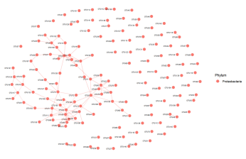
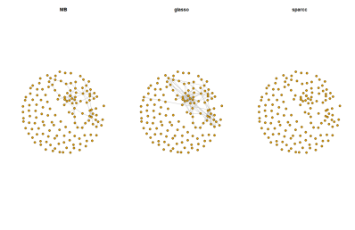
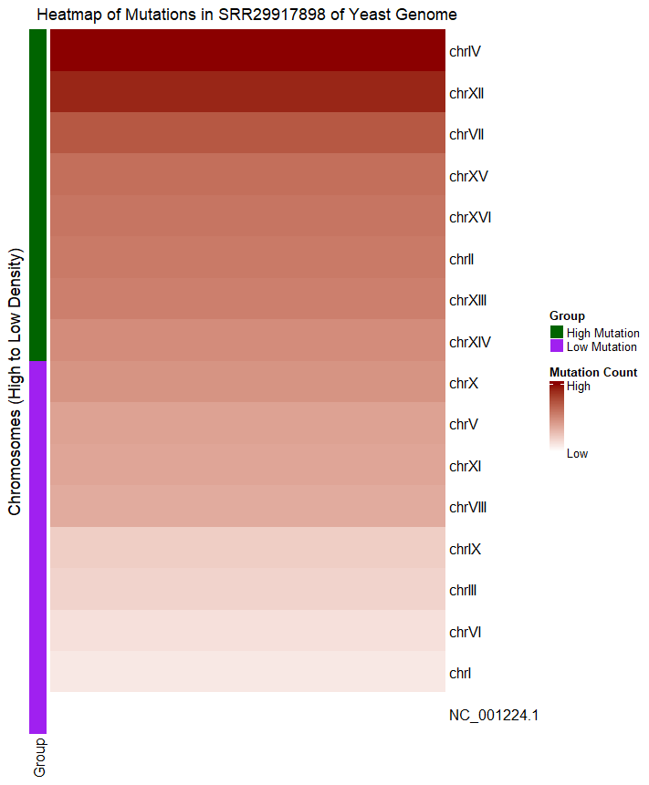
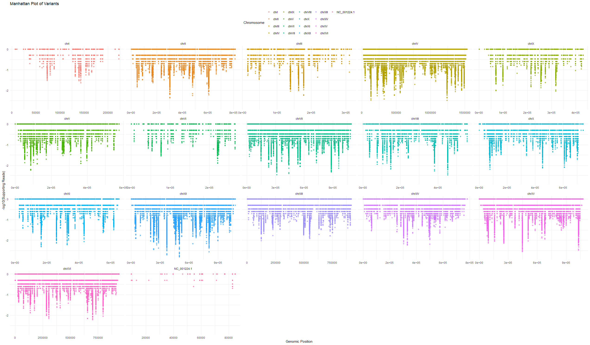
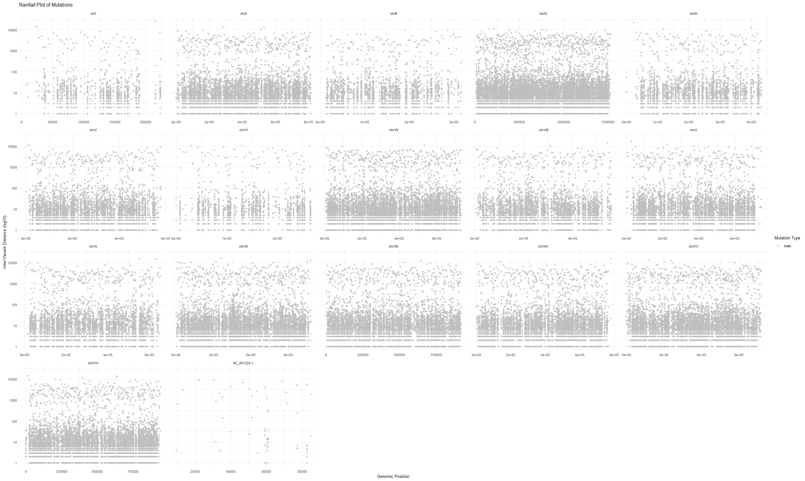

## Overview
This repository is showcasing various bioinformatics visualizations from the work of Zhenghao Xiao.

## Correlation Network for Co-Abundance 

## Mutation Analysis Visualization Using Self-Developed R Package--LegitXMut (Heatmap, Rainfall Plot, Manhattan Plot)

